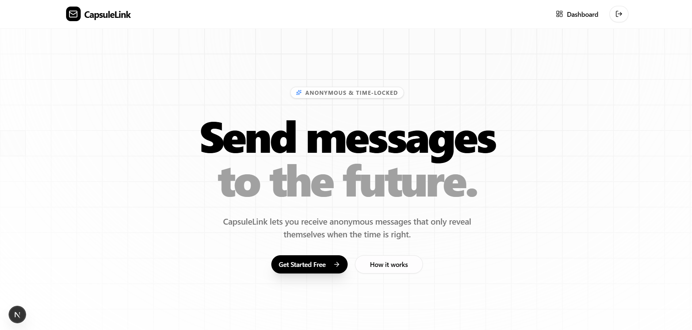
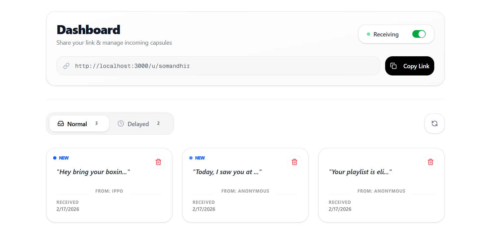
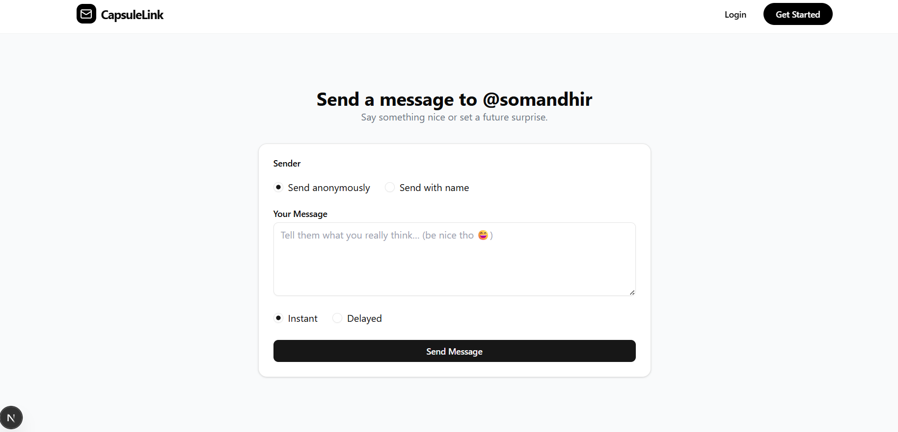

# CapsuleLink

A digital time capsule platform that lets you send messages sealed until a future date. Built with Next.js 15, MongoDB, and a Bento Grid UI aesthetic.

---

## Screenshots

### Landing Page


### Dashboard


### Public Profile Page



---

## What It Is

CapsuleLink is built around one idea: delayed, honest communication. Unlike instant messaging, it introduces anticipation — you write a message, seal it, and the recipient can't read it until the exact moment you choose. The content never leaves the server while locked, so there's no way to peek at it through the browser's network tab.

Messages come in two types — **Normal** (instant) and **Delayed** (time-locked). The dashboard separates them into tabs, shows live countdown timers, and lets you manage everything from one place.

---

## Tech Stack

- **Framework:** Next.js 15+ (App Router)
- **Language:** TypeScript (Strict Mode)
- **Styling:** Tailwind CSS v4.0
- **Auth:** Auth.js (NextAuth.js) — Google OAuth + Credentials Provider
- **Database:** MongoDB via Mongoose
- **Animations:** Framer Motion + Lucide React
- **UI Components:** shadcn/ui (Radix UI primitives)
- **HTTP Client:** Axios

---

## Features

- **Sealed messages** — delayed message content stays hidden server-side until the unlock date passes
- **Live countdown timers** — a custom `useCountdown` hook drives per-second re-renders scoped to the dialog only, keeping performance clean
- **Bento Grid dashboard** — tabbed Normal / Delayed inbox with glassmorphic cards
- **Ripple landing page** — mouse-click reactive background symbolizing messages sent into the future
- **Google OAuth** — one-click sign in, no setup required
- **Toggle availability** — users can turn off incoming messages globally

---

## Authentication — Important Note

> **Manual email/username login is currently unavailable for new users.**

The credentials provider is implemented and the flow is complete (sign-up → email verification code → login), but sending verification emails requires a verified domain on Resend. That domain isn't configured yet, so the email step is blocked. **Google OAuth works fully** and is the recommended way to sign in right now.

This will be resolved once the Resend domain is set up.

---

## API Reference

| Route | Method | Description | Auth |
|---|---|---|---|
| `/api/auth/[...nextauth]` | GET / POST | Google OAuth & Credentials auth | No |
| `/api/u/[username]/message` | POST | Send a message (normal or delayed) to a user's public profile | No |
| `/api/message/n` | GET | Fetch normal/instant messages for the logged-in user | Yes |
| `/api/message/d` | GET | Fetch delayed/time-locked messages | Yes |
| `/api/message/get/[messageId]` | GET | Get full message content — returns `"Sealed"` if still locked | Yes |
| `/api/message/delete/[messageId]` | DELETE | Permanently delete a capsule | Yes |
| `/api/accept-message` | POST | Toggle whether the user accepts new messages | Yes |
| `/api/get-user-setting` | GET | Get the current `isAcceptingMessage` status | Yes |
| `/api/resend-code` | POST | Resend email verification code | No |
| `/api/verify-code` | POST | Verify the code sent to email | No |

### The Sealed Mechanism

When `/api/message/get/[messageId]` is called for a delayed message that hasn't unlocked yet, the server returns a sanitized response instead of the real content:

```ts
const isLocked = message.type === 'delayed' && new Date(message.unlockDate) > new Date();
if (isLocked) {
  return { ...message, content: "Sealed", isLocked: true };
}
```

The raw content never leaves the server until the timer reaches zero.

---

## Database Schema

**User**
- `username` — unique, indexed
- `email` — unique
- `password` — optional (not present for OAuth users)
- `isAcceptingMessage` — global toggle
- `messages` — array of Message references

**Message**
- `receiverId` — reference to User
- `content` — hidden while locked
- `senderName` — defaults to `"Anonymous"`
- `type` — `"normal"` | `"delayed"`
- `unlockDate` — required if type is `"delayed"`
- `isRead` — for new message indicators
- `createdAt` — timestamp

---

## Project Structure (Overview)

The project follows Next.js App Router conventions. Auth pages live under `app/(auth)/` (login, sign-up, verify). API routes are under `app/api/`. Shared components include `MessageCard`, `MessageViewDialog`, `MessageForm`, `RotatingPlaceholderTextarea`, and `Navbar`. Custom hooks (`useCountdown`), helpers, lib utilities, and TypeScript types are organized under their respective directories.

---

## Getting Started

```bash
# Install dependencies
npm install

# Set up environment variables
cp .env.example 
# Fill in: MONGODB_URI, NEXTAUTH_SECRET, GOOGLE_CLIENT_ID, GOOGLE_CLIENT_SECRET, RESEND_API_KEY

# Run development server
npm run dev
```

---

## Roadmap

- [ ] Resend domain setup — enables email/password login and verification
- [ ] Email notifications when a capsule unlocks
- [ ] Image capsules — attachments blurred until unlock date
- [ ] Public settings page — update username and profile bio

---

## License

MIT
